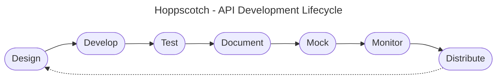

**[Hoppscotch](https://hoppscotch.io) is a community-driven end-to-end open source API development ecosystem.**

- Used by more than one million developers
- 51,000+ GitHub stars
- 100,000+ monthly users

 

<!--  -->

<!--
flowchart TD
    subgraph Data
    direction LR
    row1column1(RESTful) ~~~ row1column2(GraphQL) ~~~ row1column3(Real-time) ~~~ row1column4(RPC) ~~~ row1column5(SOAP)
    end
    A([Source control])
    subgraph Build
    direction LR
    row2column1(Design) ~~~ row2column2(Mock) ~~~ row2column3(Develop)
    end
    B([Cloud])
    C([APM])
    subgraph Test
    direction LR
    row3column1(Automated) ~~~ row3column2(Manual)
    end
    D([Source control])
    E([CI/CD])
    subgraph Deploy
    direction LR
    row4column1(Document) ~~~ row4column2(Distribute) ~~~ row4column3(Monitor)
    end
    Data --- A -- Build --- B --- C -- Test --- D --- E -- Deploy
-->
